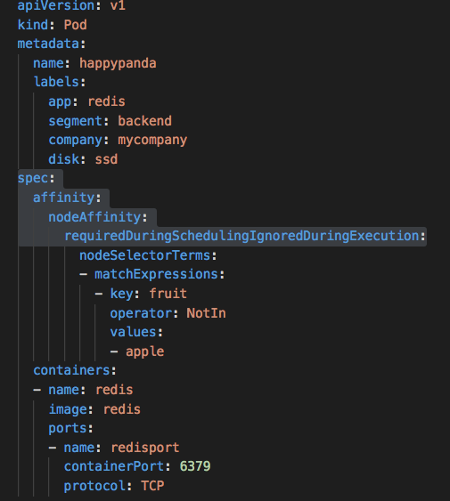

In the previous chapter, we introduced `nodeSelector`. This works well if your nodes have the required node labels, but if the nodeSelector doesn't match a label on a node, then the pod will not be scheduled. Node/Pod Affinity and Anti-Affinity resolves this issue by introducing soft and hard conditions.

<!-- needs centralising -->

>**Note**: As this is a beta feature, we won't be running any of them in this exercise, however it's important to understand the basic concepts. For more information, read the Kubernetes documentation on [Affinity and Anti-Affinity](https://kubernetes.io/docs/concepts/configuration/assign-pod-node/#affinity-and-anti-affinity).

## Node Affinity

When you look at the [Kubernetes API Reference](https://v1-10.docs.kubernetes.io/docs/reference/generated/kubernetes-api/v1.10/#nodeaffinity-v1-core), you'll notice that the two `specs` for Node Affinity are:

* `spec.affinity.nodeAffinity.preferredDuringSchedulingIgnoredDuringExecution` - **Soft NodeAffinity and Anti-Affinity**: If the node label exists, the Pod will be ran there. If not, then the Pod will be rescheduled elsewhere within the cluster.

* `spec.affinity.nodeAffinity.requiredDuringSchedulingIgnoredDuringExecution` - **Hard NodeAffinity and Anti-Affinity**: If the node label doesn't exist, then the pod won't be scheduled at all.

### Soft Node Affinity

Let's inspect the `node-soft-affinity.yaml` manifest:

`cat /manifests/node-soft-affinity.yaml`{{execute}}

<!-- needs centralising -->

The manfifest reads as: "If there are no nodes labelled as `apple`, then still schedule the pod to a node".

### Hard Node Affinity

Now inspect the `node-hard-affinity.yaml` manifest:

`cat /manifests/node-hard-affinity.yaml`{{execute}}

<!-- needs centralising -->

The manifest reads as: "If there are no nodes labelled as `apple`, then this pod won't be assigned a node by the scheduler".

## Node Anti-Affinity

Node `anti-affinity` can be achieved by using the `NotIn` operator. This will help us to ignore nodes while scheduling.

Here is an example:

<!-- needs centralising -->

